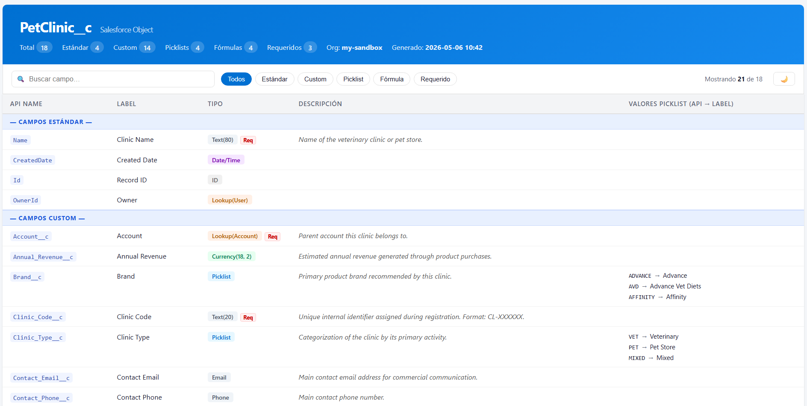
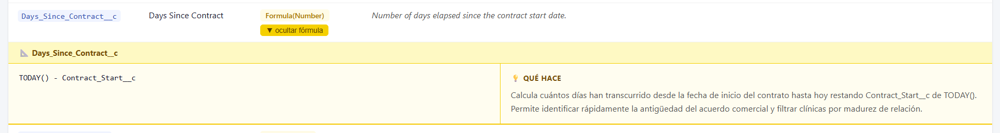
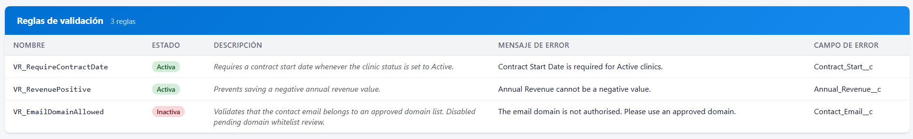
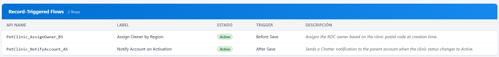
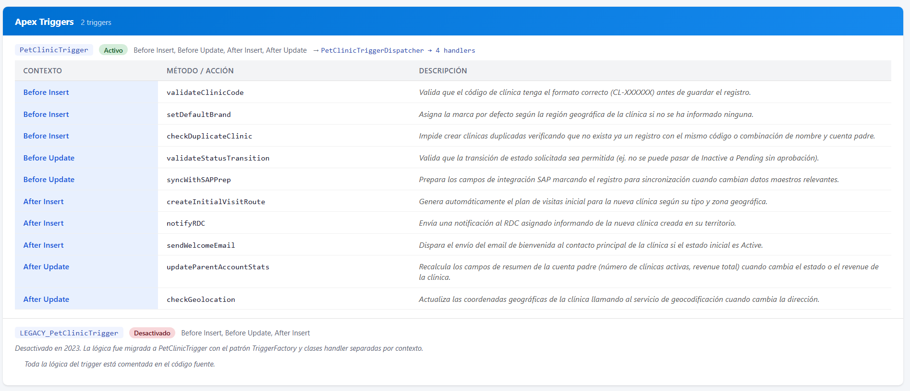
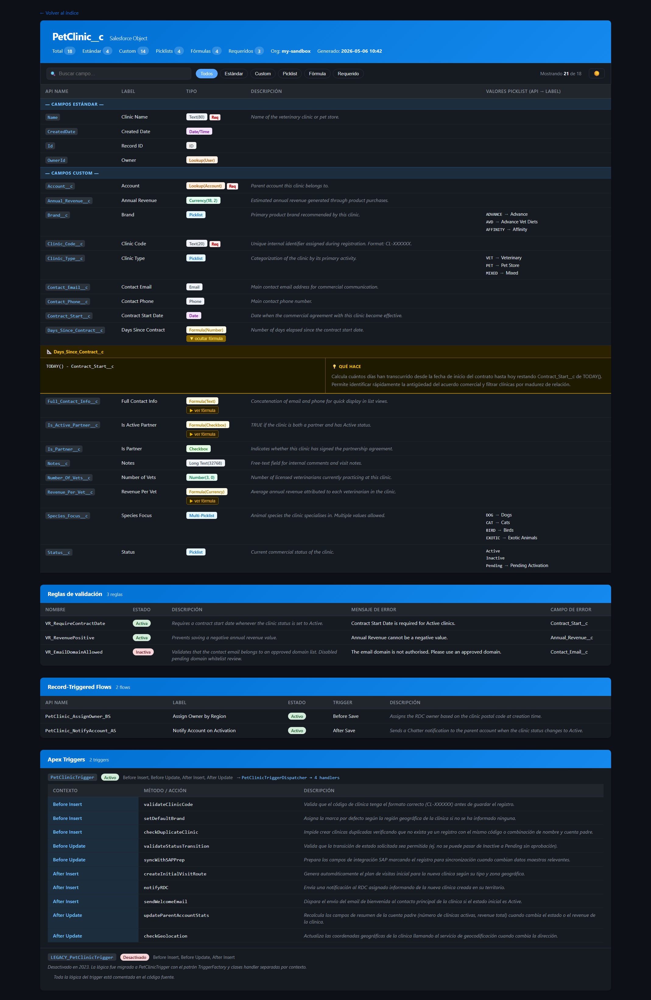

# documentar-objeto

A Claude Code skill that generates rich HTML documentation for any Salesforce object — fields, picklist values, formula explanations, validation rules, record-triggered flows and Apex triggers — with a single command.

## Features

- **Complete field catalog** — standard and custom, with type badges, required markers and picklist values (`API value → Label`)
- **Formula explanations** — expandable panel per formula field showing the code and an AI-generated explanation in Spanish
- **Validation rules** — name, status, description and error message
- **Record-Triggered Flows** — trigger type, active/inactive status and description
- **Apex Triggers** — detects TriggerFactory and direct handler patterns; lists every method per context (Before Insert, After Update, etc.)
- **Dark mode** — toggle button, persisted via `localStorage`
- **Search & filters** — real-time search by API name or label; filter buttons by type (standard, custom, picklist, formula, required)
- **Formula cache** — explanations are cached per field+formula; only regenerated when the formula changes
- **Index page** — `index.html` updated automatically after each run with object stats

## Prerequisites

| Tool | Version |
|------|---------|
| Python | 3.8 + |
| Salesforce CLI (`sf`) | 2.x |
| Claude Code | any |

The skill uses the [Anthropic SDK](https://pypi.org/project/anthropic/) to generate formula explanations. Install it once:

```bash
pip install anthropic
```

The CLI must be authenticated against the target org:

```bash
sf org login web --alias my-sandbox
```

## Installation

Copy the skill folder into the Claude Code skills directory:

```bash
# macOS / Linux
cp -r documentar-objeto ~/.claude/skills/

# Windows (PowerShell)
Copy-Item -Recurse documentar-objeto "$env:USERPROFILE\.claude\skills\"
```

Restart Claude Code (or reload the window) so the skill is picked up.

## Usage

Run the slash command from any Salesforce project directory:

```
/documentar-objeto <ObjectApiName> <OrgAlias>
```

Document a single object:

```
/documentar-objeto Account my-sandbox
```

Regenerate all previously documented objects:

```
/documentar-objeto all my-sandbox
```

The HTML file is saved to `documentator/<ObjectApiName>.html` in the current directory, and `documentator/index.html` is updated automatically.

## Examples

> Open [`docs/demo.html`](docs/demo.html) in any browser to try a fully interactive demo with a fictional `PetClinic__c` object — no server or Salesforce org required.

### Fields table — search, filter and copy API names



### Formula fields — expandable code + AI explanation



### Validation rules



### record triggeres flows



### Apex Triggers — method breakdown per context



### Dark mode



## Project structure

```
documentar-objeto/
├── SKILL.md                        # Skill instructions for Claude Code
├── README.md
├── docs/
│   ├── demo.html                   # Self-contained demo (fictional object)
│   └── screenshots/                # Images used in this README
└── scripts/
    └── sf_doc_generator.py         # HTML generator (called by the skill)
```

After running the skill, the target project gets:

```
documentator/
├── index.html
├── Account.html
├── _formula_cache_Account.json     # Persistent formula cache (do not delete)
└── ...
```

## How it works

1. **Describe** — runs `sf sobject describe` to get all field metadata  
2. **Field descriptions** — queries `FieldDefinition` via Tooling API  
3. **Formula cache** — loads cached explanations; only calls the Anthropic API for new or changed formulas  
4. **Trigger analysis** — scans local `.trigger` files, detects the delegation pattern (TriggerFactory or direct handler), reads handler classes and extracts method descriptions per context  
5. **Validation rules & flows** — queries Tooling API  
6. **HTML generation** — combines everything into a single self-contained HTML file  

## License

MIT
